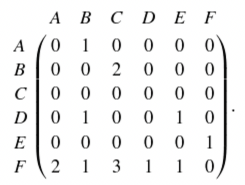

# Homework 1 - Network elements
**Due:** Tuesday, February 14, 2023 by 11:59pm
 *Read the entire assignment before starting.*

## Assignment

Write a report that contains the answers and *explains how you arrived at the answers* to the following questions. Before starting, review the [HW report guidelines](https://github.com/anwala/teaching-network-science/blob/main/spring-2023/homework/hw0/README.md).  Name your report for this assignment `hw1_report` with the proper file extension.

(**Google Colab Report (2 points**)

### Q1 (3 points)

Go through the [tutorial on Network elements](https://github.com/anwala/teaching-network-science/blob/main/spring-2023/week-2/data_340_02_s23_chp_01_network_elements.ipynb).

Implement functions for Exercises 1 -- 3    
    
### Q2 (2 points)

Consider this adjacency matrix.

 

An entry in the *i*th row and *j*th column indicates the weight of the link from node i to node j. For instance, the entry in the second row and third column is 2, meaning the weight of the link from node **B** to node **C** is 2. What kind of network does this matrix represent?

**a.** Undirected, unweighted

**b.** Undirected, weighted

**c.** Directed, unweighted

**d.** Directed, weighted

Why?

### Q3 (2 points)

Consider the network defined by the adjacency matrix in Q2. How many nodes are in this network? How many links? Are there any self-loops?

Discuss how you arrived at your answer.

### Q4 (1 point)

Webflix keeps data on customer preferences using a bipartite network connecting users to movies they have watched and/or rated. Webflix's movie library contains approximately 1,000 movies. In the fourth quarter of 2022, Webflix reported having about 5,000 users. Also, on average, a user has watched and/or rated 750 movies. Approximately how many links are in this network? Would you consider this network sparse or dense? Explain.

## Submission

Make sure that you have committed and pushed your local repo to your private GitHub repo (inside the `hw1` folder).  Your repo should include your report, images, and any code you developed to answer the questions.  Include "Ready to grade @anwala" in your final commit message. 
