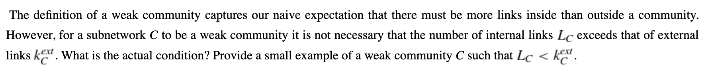

# Homework 6 - Communities
**Due:** Thursday, May 12, 2023 by 11:59pm
 *Read the entire assignment before starting.*

## Assignment

Write a report that contains the answers and *explains how you arrived at the answers* to the following questions. Before starting, you are encouraged to review the [Chapter 6 Python Google Colab notebook](https://github.com/anwala/teaching-network-science/blob/main/spring-2023/week-12/data_340_02_s23_chp_06_network_models.ipynb). Name your report for this assignment `final_exam_report` with the proper file extension.

(**Google Colab Report (2 points**)

### Q1 (2 points)

Strong communities are also weak communities but the converse is not true, in general. Provide an example of a weak community which is not a strong community.

### Q2 (2 points)

 

### Q3 (2 points)

 

### Q4 (2 points)

## Submission

Make sure that you have committed and pushed your local repo to your private GitHub repo (inside the `final_exam` folder).  Your repo should include your report, images, and any code you developed to answer the questions.  Include "Ready to grade @anwala" in your final commit message. 
